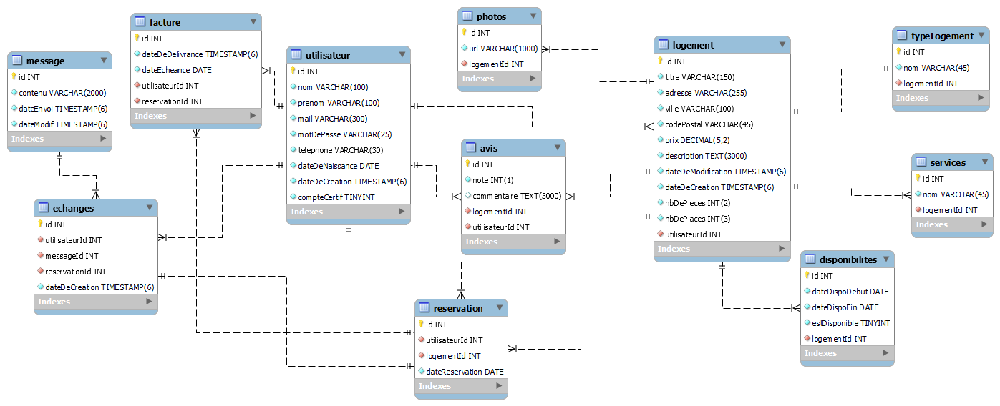

# __Totally Not AirBnb__

Ce projet est un projet d'école consistant à créer une base de données avec un cahier des charges pour satisfaire les besoins d'un client.

## Groupe sur le projet

----------------------------

- Kevin Lebeau : <https://github.com/kevmorlo>
- Lucas Chevalier  : <https://github.com/Lucas-Chevalier>
- Nicolas Guillemin  : <https://github.com/Nicox44>
- Valentin Gendrot : <https://github.com/nitnel>

## Langages utilisés ?

----------------------------

- SQL
- MarkDown

    Modèle physique de données :

  

## License

Cette œuvre est mise à disposition selon les termes de la <a rel="license" href="http://creativecommons.org/licenses/by-sa/4.0/">
Licence Creative Commons Attribution -  Partage dans les Mêmes Conditions 4.0 International</a>. 

